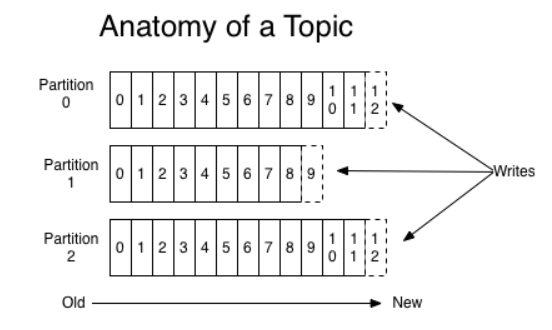
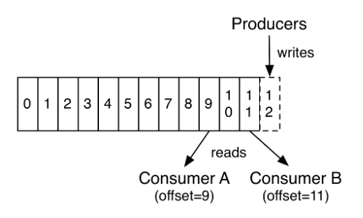
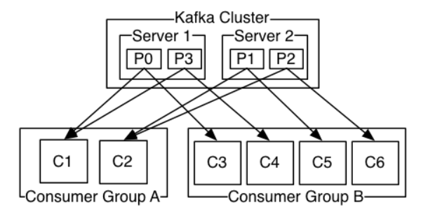
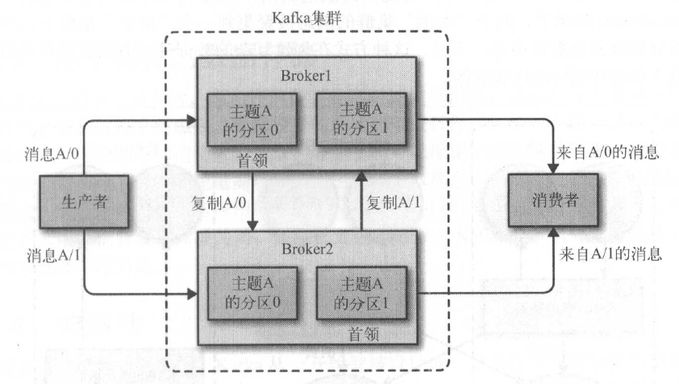

# Kafka
## feature
* 发布与订阅系统。
* 消息持久化。
   1. 依赖文件系统，pagecache-centric
   2. 常量级操作。持久化队列建立在简单的文件读取和追加
* 高吞吐量，支持实时日志聚合
   1. 批处理。使用‘message set’，更大网络数据包，更大顺序磁盘操作和连续内存块
   2. 零拷贝优化。linux sendfile系统调用
   3. 数据压缩。
* 分布式、可分区、实时处理消息。依赖ZooKeeper
* 很好处理大量积压数据，能周期性加载离线数据处理
* 低延迟消息系统 
* 可靠消息传递
* 容错
## 使用场景
* 消息系统。高吞吐量，分区，复制，容错
* 站点活动追踪。发布和订阅模式
* 日志聚合。良好性能，持久性保证和低的端到端延迟
* 流数据处理。
* EventSource。
## 与其他消息队列对比
&ensp;|redis|kafka|rabbitmq|rocketmq|activemq|disque
--|:--:|:--:|:--:|:--:|:--:|:--:
开发语言|c|Scala|Erlang|Java|Java|c
单机吞吐量||十万级|万级|十万级|万级|
协议||TCP, poll|AMQP, push/poll|TCP, poll|AMQP, push/poll|
消息优先级||不支持|支持|不支持|支持|
消息广播||不支持|支持|支持|支持|
消息批处理||支持|不支持|支持|不支持|
延迟消息||不支持|支持|支持|支持|
消息堆积||支持|支持（超过阈值影响性能）|支持|支持（有上限）|
消息追溯||支持（仅offset）|支持|支持（offset、timestamp）|支持|
消息事务||支持|支持|支持|支持|
负载均衡||支持（zookeeper）|支持|支持(master-slave)|支持(zookeeper)|
集群方式||leader-slave|mirror|master-slave|master-slave|
运维管理||kafka-manager|rabbitmq-management|||
## 实现原理简介
### 主题和分区
* 一个主题可以分为若干个分区。消息以追加的形式写入分区，然后按先入先出的顺序读取。分区内消息有序，主题下消息不保证有序。
* 分区是kafka横向扩展和并行化的基础，分区可以有效提高吞吐量。
* 发消息时，kafka根据hash算法分配到topic的某一分区，所以分区数量变化会改变分配。较好地解决方案是预留分区。
* kafka通过分区实现数据冗余和伸缩性，可以跨多个服务器。

### 生产者和消费者
* 生产者创建消息。一个消息发送到特定主题，并均衡地分不到所有分区上，也可以指定到固定的分区，保证消息的有序性。
* 生产者异步分发消息。尝试在内存中累积数据，尝试在单个请求中发送大的数据，可以自行设定（大小和时间延迟）。
* 消费者读取消息。消费者订阅多个topic，根据消息的在分区的偏移量获取消息。偏移量是不断递增的整型，在给定分区唯一。偏移量保证消息的读取时间消耗为O(1)，并且支持大量消息的累积而不影响读取效率。
* 消费者采用poll的模式。

* 消费者也可以是消费者组的一部分。消费者组保证一个分区的消息只被一个消费者使用。

### broker和集群
* broker是一个独立的kafka服务器。broker接受生产者的消息，设置偏移量，并提交消息到磁盘保存。同时为消费者提供服务，对读取分区做出响应。单个broker可以处理数千个分区和百万级的消息。
* broker为集群的组成部分。一个broker作为leader，进行集群管理。一个分区从属于一个broker，并可以分配给多个broker，即分区复制，提供消息冗余。
* 建议每个broker拥有4000个分区，一个集群最多200000个分区。

* 多集群。数据类型分离和安全需求，工具MirrorMaker。
### 分区副本
* 配置分区备份到服务器的数量，保证一个broker挂掉的容错。leader负责提供数据，follower只复制leader的写的数据，并且不落后。
* 生成者可以控制消息提交或不提交。等待leader和follower提交会造成延迟但保证消息不丢失；只等待leader提交可以降低延迟但不确保不丢失。
### 主题和分区数量的影响。
* kafka建议使用大而少的topic，分区的规模根据consumer主机的数量伸缩而非数据的特性。
* kafka推荐一个topic，然后根据user_id进行分区，可以保证区域内数据的顺序性，而且拥有更高的效率。
* 在consumer端，kafka会将一个分区的数据分配给一个consumer端线程，因此更多地分区会提供高的吞吐量。
* 一个分区对应文件系统的一个目录，其中包含两个文件，索引和实际数据，过多分区需要底层操作系统可以打开更多的文件句柄。
* 如果一个broker的分区过多，当broker挂掉，这个broker可能是一半左右分区的leader，一个leader选举需要5ms，这将消耗一定的时间。
* 分区的数量建议100×b×r（b：broker，r：复制因子）
* 分区会缓存一定的数据发送，因此过多的分区会占用大量的内存。
## 游戏中可能的应用
* 邮件系统
* 聊天系统
* 日志系统
## 部署与运维
## 参考资料
http://www.thinkyixia.com/2017/10/25/kafka-2/
https://kafka.apache.org/documentation
https://www.confluent.io/blog/how-choose-number-topics-partitions-kafka-cluster
https://cwiki.apache.org/confluence/display/KAFKA/FAQ#FAQ-HowmanytopicscanIhave?
https://medium.com/@Alibaba_Cloud/kafka-vs-rocketmq-multiple-topic-stress-test-results-d27b8cbb360f
